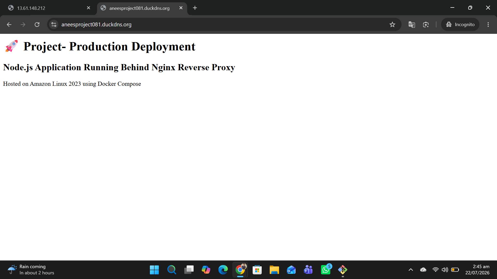
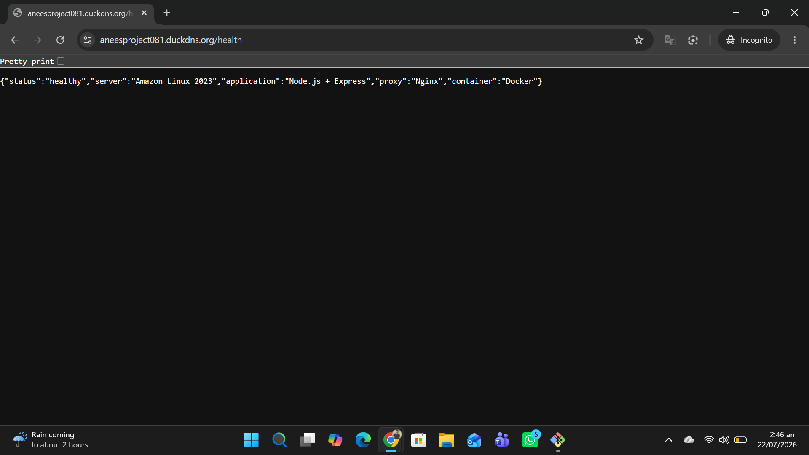
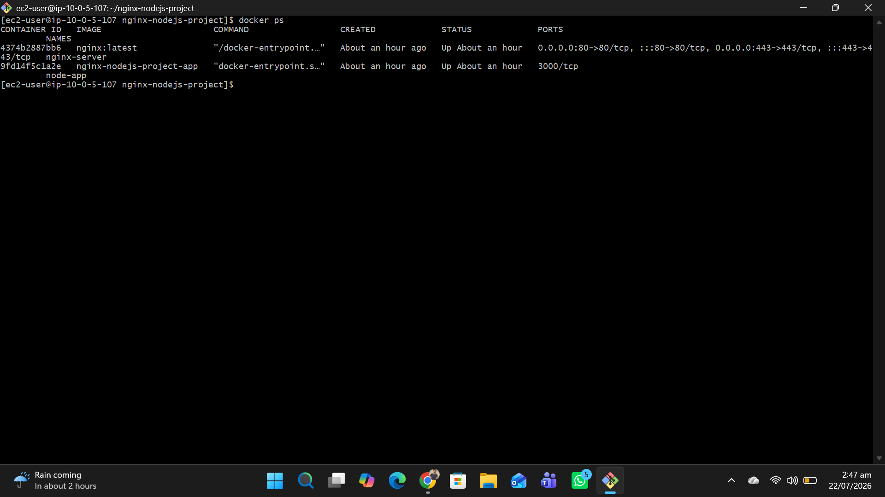
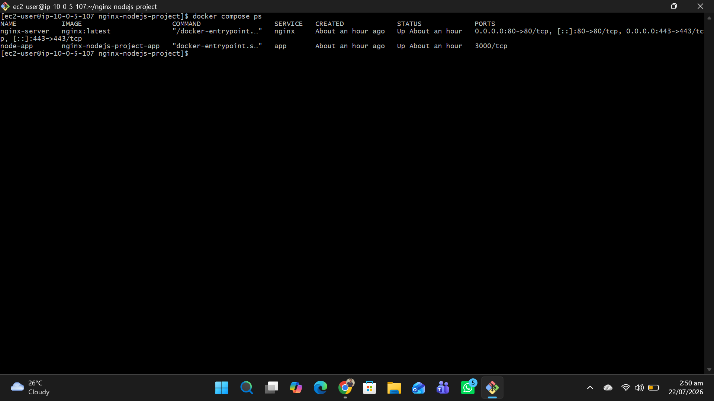
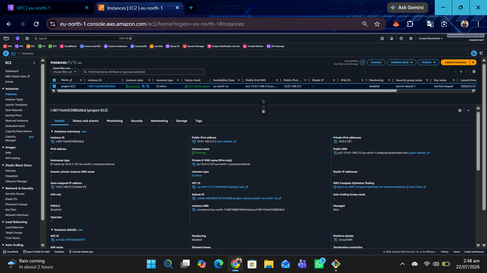
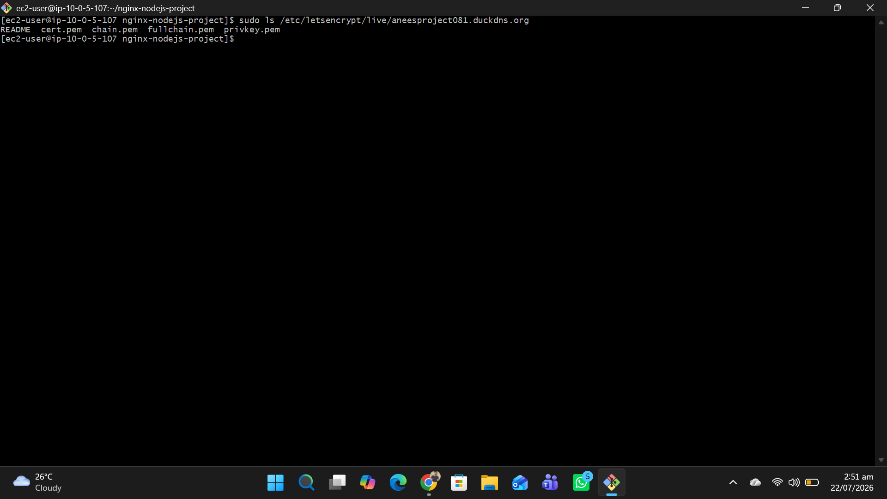
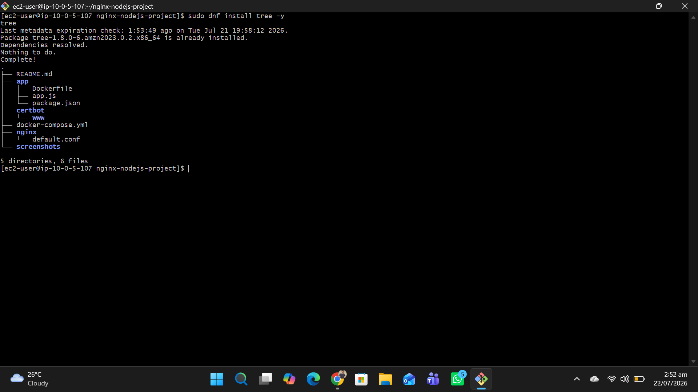

# 🚀 Node.js Production Deployment on AWS EC2

A production-ready deployment of a Dockerized **Node.js + Express** application using **Nginx Reverse Proxy**, **Docker Compose**, **DuckDNS**, and **Let's Encrypt SSL** on **Amazon Linux 2023 (AWS EC2)**.

---

## 🌟 Features

- Dockerized Node.js application
- Nginx Reverse Proxy
- Docker Compose orchestration
- HTTPS using Let's Encrypt SSL
- DuckDNS custom domain
- Health Check endpoint
- Amazon Linux 2023 on AWS EC2
- Production deployment

---

## 🛠 Tech Stack

- AWS EC2
- Amazon Linux 2023
- Docker
- Docker Compose
- Node.js
- Express.js
- Nginx
- DuckDNS
- Let's Encrypt SSL
- Git & GitHub

---

## 📁 Project Structure

```text
nginx-nodejs-project/
│
├── app/
│   ├── app.js
│   ├── Dockerfile
│   └── package.json
│
├── nginx/
│   └── default.conf
│
├── screenshots/
│
├── docker-compose.yml
├── .gitignore
└── README.md
```

---

## 🚀 Deployment Architecture

```
Internet
    │
    ▼
DuckDNS
    │
HTTPS (SSL)
    │
Nginx Reverse Proxy
    │
Node.js Express
    │
Docker Compose
    │
AWS EC2 (Amazon Linux 2023)
```

---

## 📸 Screenshots

### Home Page



---

### Health API



---

### Docker Containers



---

### Docker Compose



---

### EC2 Instance



---

### HTTPS Test


---

### SSL Certificate



---

### Project Structure



---

## ▶️ Run Locally

```bash
docker compose up -d --build
```

---

## 🔍 Health Check

```text
https://aneesproject081.duckdns.org/health
```

---

## 👨‍💻 Author

**Anees Ahmad**

- GitHub: https://github.com/aneesahmad081
- LinkedIn: www.linkedin.com/in/aaneesahmad
